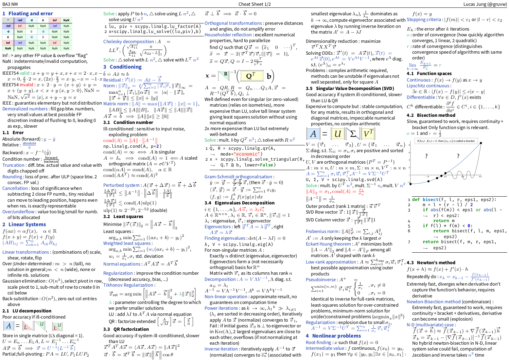
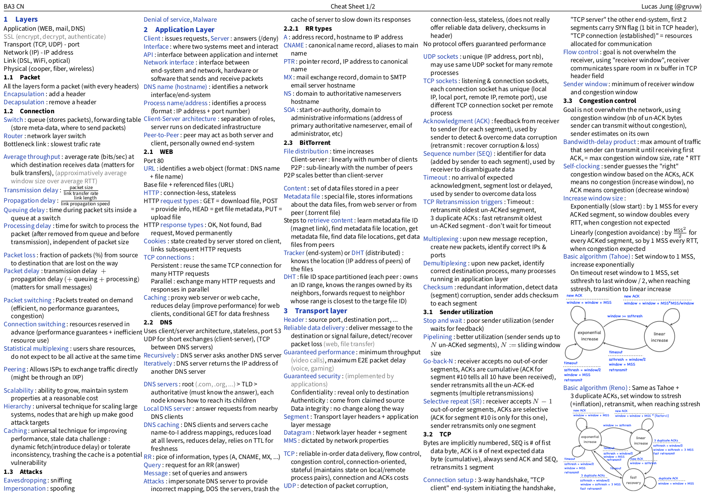

# Cookiecutter Cheatsheet Template

Template for writing beautiful and highly condensed LaTeX cheat sheets.

**Note**: This project uses the [CookieCutter](https://github.com/cookiecutter/cookiecutter) template engine.

**Usage**: `cookiecutter gh:gruvw/cookiecutter-cheatsheet`

## Examples

You can see some examples of cheat sheets that I wrote using this template under the [./examples](./examples/) folder.

### Previews

**Numerical Methods For Visual Computing And Machine Learning** (EPFL CS-328)

**Computer Networks** (EPFL COM-208)

